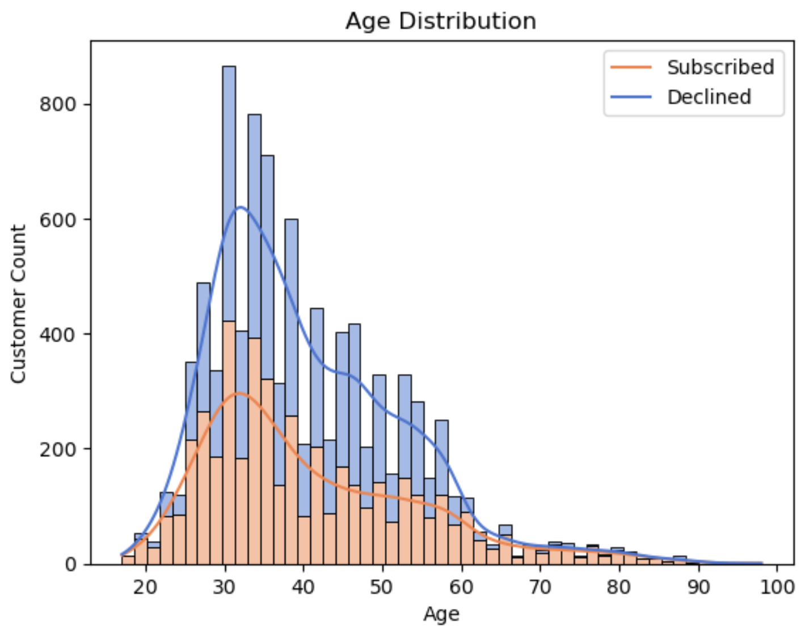
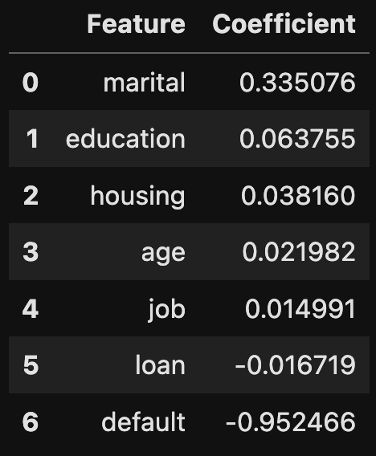

# Practical Assignment III

## Bank Marketing Data
The data consists of a group of people who were contacted via phone about subscribing to a fixed-term deposit. There are approximately 45,000 observations with 17 features. There are 48 campaigns. The data included demographic information of the customer and economic indicators [source](https://archive.ics.uci.edu/dataset/222/bank+marketing).

|Column|Variable   |Type         |Description                                                                                                                                          |
|------|-----------|-------------|-----------------------------------------------------------------------------------------------------------------------------------------------------|
|1     | age       | numeric     | The client's age.                                                                                                                                   |
|2     | job       | categorical | Categories are admin, unknown, unemployed, management, housemaid, entrepreneur, student, blue-collar, self-employed, retired, technician, services. |
|3     | marital   | categorical | Categories are married, divorced, single; note: divorced means divorced or widowed.                                                                 |
|4     | education | categorical | Categories are unknown, secondary, primary, tertiary.                                                                                               |
|5     | default   | binary      | Has credit in default?                                                                                                                              |
|6     | balance   | numeric     | Average yearly balance in euros.                                                                                                                    |
|7     | housing   | binary      | Has housing loan?                                                                                                                                   |
|8     | loan      | binary      | Has personal loan?                                                                                                                                  |
|9     | contact   | categorical | Categories are unknown, telephone, cellular.                                                                                                        |
|10    | day       | numeric     | Last contact day of the month.                                                                                                                      |
|11    | month     | categorical | Last contact month of year.                                                                                                                         |
|12    | duration  | numeric     | Last contact duration in seconds.                                                                                                                   |
|13    | campaign  | numeric     | Number of contacts performed during this campaign and for this client, includes last contact.                                                       |
|14    | pday      | numeric     | Number of days that passed by after the client was last contacted from a previous campaign, -1 means client was not previously contacted.           |
|15    | previous  | numeric     | Number of contacts performed before this campaign and for this client.                                                                              |
|16    | poutcome  | categorical | Outcome of the previous marketing campaign, unknown, other, failure, success.                                                                       |
|17    | y         | binary      | Has the client subscribed a term deposit?                                                                                                           |

## Business Understanding
The business objective is to identify the most important features in determining whether a customer will subscribe to a term deposit. The derived results will be used to increase the number of customers subscribing to the bank product. The goal is to understand which features need to be included or excluded from the data and to determine which model performs the best. Recommendations will be provided based on the derived insights.

## Data Models
The problem requires classification of customers who are most likely to subscribe to the bank product. There will be 4 models used to identify the characteristics of customers who are subscribed. They are:
* Logistic Regression - Excellent for finding linear relationships.
* Decision Trees - Easiest to interpret with visualization.
* Support Vector Machines - Effective with high-dimensional data.
* K-Nearest Neighbors - Ideal for non-linear data.

## Process
A simple baseline model will be Logistic Regression due to its speed and interpretability. The models will be tuned using GridSearchCV to determine which hyperparameters will create the most efficient model. Efficiency refers to finding the optimal balance between training time and accuracy.

## Findings
Some features were more important in certain models than others. For example, the Decision Tree model identified default status and age as the most significant features, while marital status and default had the largest coefficients in the logistic regression model.

Interestingly, the Decision Tree model exhibited bias towards default status and age. With 79% of the class labeled as "no," the model may be influenced by this imbalance. Additionally, the age distribution peaked at 30 years old, coinciding with the highest number of subscriptions across all age groups. This highlights the model's tendency to favor dominant classes.

  

The logistic regression model identified marital status and default status as its most influential coefficients. Specifically, the married and divorced categories exhibited a higher subscription rate compared to others. The presence of default status aligns with expectations, as individuals facing financial constraints may be less likely to invest in a term deposit.

    
&nbsp;
  
  

The baseline models, employing default parameters for K-Nearest Neighbor and Decision Trees, exhibited overfitting issues, evidenced by significantly higher training scores compared to test scores. Specifically, there was a 13% and 30% decrease in accuracy when testing against unseen data for K-Nearest Neighbor and Decision Trees, respectively.

Although tuning the models yielded only marginal improvements, it helped alleviate the overfitting problem to some extent. The models underwent tuning with multiple cross-validation folds, ranging from 5 to 10, yet failed to significantly impact accuracy.

## Summary
The dataset exhibited imbalance, impacting the accuracy of machine learning models. Non-linear feature relationships posed a challenge for models like KNN and SVM, resulting in average performance even after hyperparameter tuning. These limitations indicate that traditional models may not be suitable for this dataset, suggesting a neural network for uncovering complex non-linear relationships.

The recommendation for the marketing team is to prioritize key metrics: age, marital status, and number of campaigns. Notably, the 30-40 age range and married/divorced individuals showed the highest subscription rates. Additionally, most subscriptions occurred with fewer than 5 contacts. Therefore, I suggest a targeted marketing campaign focusing on individuals aged 30-40, who are married or previously married, with a maximum of 5 contacts per customer.

[Link to notebook](practical_application_III.ipynb)
